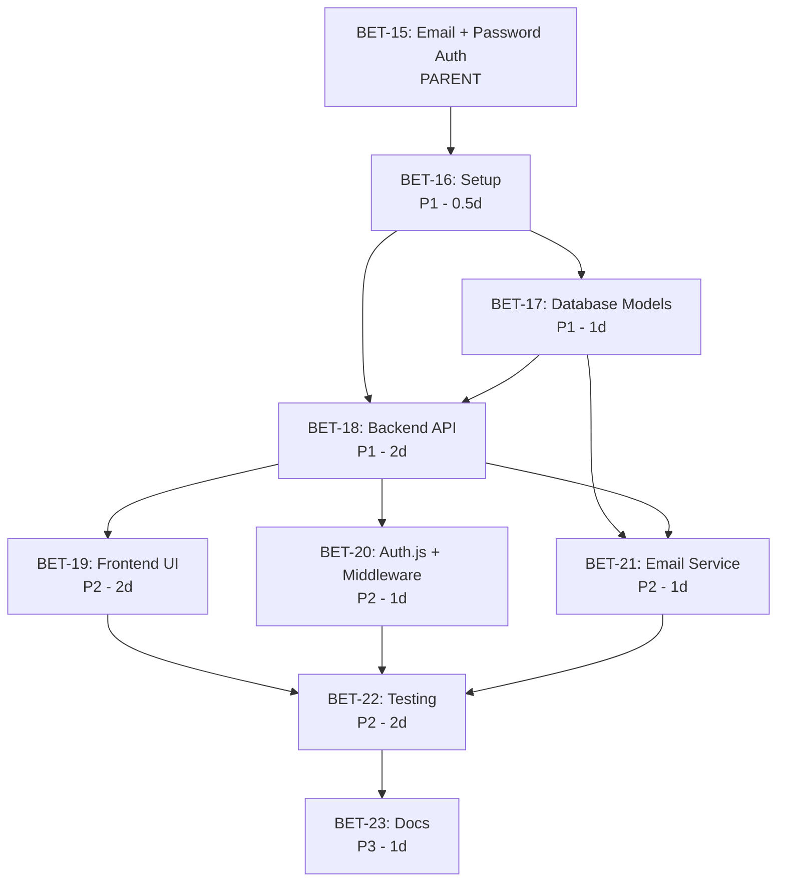

# BET-15: Identidad Tradicional (Email + Contraseña) - Roadmap Ejecutable

**Issue Padre:** [BET-15: Identidad Tradicional (Email + Contraseña)](https://linear.app/betancourt-website/issue/BET-15/identidad-tradicional-email-contrasena)
**Fecha de Creación:** 2025-12-25
**Total de Issues Creados:** 8 fases
**Estimación Total:** ~2-2.5 semanas (depende del ritmo de desarrollo)

---

## Resumen Ejecutivo

Este roadmap convierte el plan de solución de BET-15 en un conjunto ejecutable de issues en Linear. La implementación está dividida en 8 fases lógicas que van desde la configuración inicial hasta el deploy en producción, enfocándose en seguridad, performance y experiencia de usuario.

### Objetivos del Proyecto
- Implementar autenticación con email y contraseña segura
- Garantizar seguridad mediante Argon2id password hashing
- Implementar flujo completo de recuperación de contraseña
- Prevenir ataques comunes (brute force, enumeration, timing attacks)
- Mantener sesiones seguras con JWT stateless
- Cumplir con OWASP security guidelines 2025

---

## Estructura del Roadmap

```
BET-15 (Padre)
├── Fase 1: Setup y Dependencias [BET-16]
├── Fase 2: Modelos de BD [BET-17]
├── Fase 3: Backend API [BET-18]
├── Fase 4: Frontend UI [BET-19]
├── Fase 5: Auth.js + Middleware [BET-20]
├── Fase 6: Email Service [BET-21]
├── Fase 7: Testing y Seguridad [BET-22]
└── Fase 8: Docs y Deploy [BET-23]
```

---

## Fases de Implementación

### 🔧 Fase 1: Setup y Configuración de Dependencias
**Issue:** [BET-16](https://linear.app/betancourt-website/issue/BET-16/fase-1-setup-y-configuracion-de-dependencias)
**Prioridad:** Alta (P1)
**Estimación:** 0.5 días
**Labels:** `backend`, `frontend`, `setup`

**Objetivos:**
- Instalar Auth.js (NextAuth.js v5) con Credentials Provider
- Instalar Prisma/ORM para Next.js
- Instalar Argon2 hasher para Django
- Instalar djangorestframework-simplejwt
- Generar secrets criptográficamente seguros

**Acceptance Criteria:**
- [ ] Auth.js instalado y configurado en frontend
- [ ] Argon2 hasher configurado en Django
- [ ] JWT libraries instaladas
- [ ] Archivos .env con placeholders
- [ ] Secrets generados de forma segura
- [ ] No hay conflictos de dependencias

**Dependencias:** Ninguna (punto de inicio)

---

### 🗄️ Fase 2: Modelos de Base de Datos y Migraciones
**Issue:** [BET-17](https://linear.app/betancourt-website/issue/BET-17/fase-2-modelos-de-base-de-datos-y-migraciones)
**Prioridad:** Alta (P1)
**Estimación:** 1 día
**Labels:** `backend`, `database`, `auth`

**Objetivos:**
- Crear Custom User Model extendiendo AbstractUser de Django
- Configurar email como USERNAME_FIELD
- Crear modelo PasswordResetToken con lógica de expiración
- Generar y aplicar migraciones
- Crear índices en campos críticos

**Acceptance Criteria:**
- [ ] Custom User Model con UUID primary key
- [ ] Email configurado como identificador único
- [ ] PasswordResetToken model funcional
- [ ] Migraciones aplicadas sin errores
- [ ] Índices creados en email y token fields
- [ ] Models visibles en Django Admin

**Dependencias:**
- ✅ **BET-16** (requiere setup completado)

---

### 🔐 Fase 3: Backend API - Endpoints de Autenticación
**Issue:** [BET-18](https://linear.app/betancourt-website/issue/BET-18/fase-3-backend-api-endpoints-de-autenticacion)
**Prioridad:** Alta (P1)
**Estimación:** 2 días
**Labels:** `backend`, `api`, `auth`, `security`

**Objetivos:**
- Implementar POST /api/auth/register/
- Implementar POST /api/auth/login/
- Implementar POST /api/auth/forgot-password/
- Implementar POST /api/auth/reset-password/
- Configurar Argon2 password hashing
- Implementar rate limiting
- Implementar anti-enumeration (timing-safe comparisons)

**Acceptance Criteria:**
- [ ] Endpoint de registro crea usuarios y hashea passwords
- [ ] Login valida credenciales con timing-safe
- [ ] Mensajes de error genéricos (anti-enumeration)
- [ ] Rate limiting activo
- [ ] JWT tokens generados correctamente
- [ ] Password reset flow completo
- [ ] Passwords nunca en texto plano

**Dependencias:**
- ✅ **BET-16** (requiere dependencias)
- ✅ **BET-17** (requiere modelos de BD)

---

### 🎨 Fase 4: Frontend - Formularios y Componentes UI
**Issue:** [BET-19](https://linear.app/betancourt-website/issue/BET-19/fase-4-frontend-formularios-y-componentes-ui)
**Prioridad:** Media (P2)
**Estimación:** 2 días
**Labels:** `frontend`, `ui`, `auth`

**Objetivos:**
- Crear AuthContext provider
- Crear RegisterForm con validación en tiempo real
- Crear LoginForm con manejo de errores
- Crear ForgotPasswordForm
- Crear ResetPasswordForm con password strength meter
- Crear AuthModal contenedor
- Integrar con Navbar

**Acceptance Criteria:**
- [ ] AuthContext expone signIn, signOut, session
- [ ] RegisterForm valida email y password en tiempo real
- [ ] Password strength meter funcional
- [ ] LoginForm muestra errores genéricos
- [ ] ForgotPasswordForm no revela si email existe
- [ ] ResetPasswordForm funcional
- [ ] Forms responsive y accesibles (WCAG 2.1 AA)
- [ ] Mensajes traducidos EN/ES

**Dependencias:**
- ✅ **BET-18** (requiere API endpoints funcionando)

---

### 🛡️ Fase 5: Auth.js Configuration y Middleware
**Issue:** [BET-20](https://linear.app/betancourt-website/issue/BET-20/fase-5-authjs-configuration-y-middleware)
**Prioridad:** Media (P2)
**Estimación:** 1 día
**Labels:** `frontend`, `backend`, `auth`, `middleware`

**Objetivos:**
- Configurar Auth.js con Credentials Provider
- Implementar callbacks (JWT, session)
- Crear middleware.ts para route protection
- Proteger rutas /dashboard y /admin
- Configurar cookies (HttpOnly, Secure, SameSite)

**Acceptance Criteria:**
- [ ] Auth.js configurado correctamente
- [ ] Callbacks JWT y session funcionando
- [ ] Middleware protege rutas
- [ ] Usuarios no autenticados redirigidos
- [ ] Cookies con flags de seguridad
- [ ] Session validation <10ms
- [ ] No hay flickering en UI

**Dependencias:**
- ✅ **BET-18** (requiere API backend)
- ✅ **BET-19** (mejor UX con componentes frontend)

---

### 📧 Fase 6: Email Service - Password Reset
**Issue:** [BET-21](https://linear.app/betancourt-website/issue/BET-21/fase-6-email-service-password-reset)
**Prioridad:** Media (P2)
**Estimación:** 1 día
**Labels:** `backend`, `email`, `auth`

**Objetivos:**
- Configurar Django email backend
- Crear template HTML para password reset
- Implementar generación de tokens seguros
- Implementar envío de email con link
- Configurar rate limiting para emails

**Acceptance Criteria:**
- [ ] Email backend configurado
- [ ] Template HTML responsive y branded
- [ ] Tokens criptográficamente seguros
- [ ] Emails se envían exitosamente
- [ ] Link de reset con token en path
- [ ] Rate limiting previene spam
- [ ] Emails logeados para auditoría
- [ ] Desarrollo usa console backend

**Dependencias:**
- ✅ **BET-17** (requiere PasswordResetToken model)
- ✅ **BET-18** (requiere endpoints de reset)

---

### 🧪 Fase 7: Testing y Validación de Seguridad
**Issue:** [BET-22](https://linear.app/betancourt-website/issue/BET-22/fase-7-testing-y-validacion-de-seguridad)
**Prioridad:** Media (P2)
**Estimación:** 2 días
**Labels:** `testing`, `qa`, `security`

**Objetivos:**
- Testing funcional completo (registro, login, password reset)
- Testing de seguridad (hashing, cookies, JWT, rate limiting)
- Testing de performance (targets de tiempo)
- Testing de UX (responsive, accesibilidad, i18n)

**Acceptance Criteria:**

**Funcional:**
- [ ] Registro exitoso con datos válidos
- [ ] Email duplicado rechazado
- [ ] Login exitoso y fallido funcionan
- [ ] Password reset flow completo

**Seguridad:**
- [ ] Passwords hasheadas con Argon2id
- [ ] Cookies HttpOnly, Secure, SameSite
- [ ] JWT firmado correctamente
- [ ] Rate limiting funciona
- [ ] Anti-enumeration efectivo
- [ ] CSRF protection activo

**Performance:**
- [ ] Password hashing <500ms
- [ ] Session validation <10ms
- [ ] Login flow <2s
- [ ] Email enviado <5s

**UX:**
- [ ] Forms responsive
- [ ] WCAG 2.1 AA compliance
- [ ] Keyboard navigation
- [ ] Mensajes traducidos

**Dependencias:**
- ✅ **BET-19** (Frontend)
- ✅ **BET-20** (Middleware)
- ✅ **BET-21** (Email Service)

---

### 📚 Fase 8: Documentación y Preparación para Deploy
**Issue:** [BET-23](https://linear.app/betancourt-website/issue/BET-23/fase-8-documentacion-y-preparacion-para-deploy)
**Prioridad:** Baja (P3)
**Estimación:** 1 día
**Labels:** `documentation`, `devops`

**Objetivos:**
- Crear .env.example completo
- Documentar endpoints de API
- Actualizar README
- Documentar password requirements
- Documentar decisiones de seguridad
- Crear guía de troubleshooting
- Verificar que no hay secrets en repo

**Acceptance Criteria:**
- [ ] .env.example completo
- [ ] API endpoints documentados
- [ ] README actualizado
- [ ] Password requirements documentados
- [ ] Código crítico comentado
- [ ] Guía de troubleshooting
- [ ] Git history limpio
- [ ] Checklist de deploy completo
- [ ] Email provider configurado para prod

**Dependencias:**
- ✅ **BET-22** (requiere testing completo)

---

## Gráfico de Dependencias



---

## Timeline Estimado

| Semana | Fases | Issues | Estimación |
|--------|-------|--------|------------|
| **Semana 1** | Setup + DB + Backend API | BET-16, BET-17, BET-18 | 3.5 días |
| **Semana 2** | Frontend + Auth.js + Email | BET-19, BET-20, BET-21 | 4 días |
| **Semana 3** | Testing + Docs | BET-22, BET-23 | 3 días |
| **TOTAL** | 8 Fases | 8 Issues | **10.5 días** |

> **Nota:** Los tiempos son estimaciones y pueden variar según la experiencia del equipo y complejidad de integración.

---

## Criterios de Éxito (del Plan de Solución)

### Funcionales
- ✅ Usuarios pueden registrarse con email y contraseña
- ✅ Usuarios pueden iniciar sesión con credenciales
- ✅ Contraseñas hasheadas con Argon2id (nunca texto plano)
- ✅ Validación de fortaleza de contraseña funciona
- ✅ Prevención de emails duplicados
- ✅ Flujo completo de recuperación de contraseña
- ✅ Rate limiting protege contra brute force
- ✅ Mensajes de error seguros (anti-enumeration)
- ✅ Sesión automática post-registro

### No Funcionales
- ✅ Performance: <500ms hashing, <10ms validation
- ✅ Security: OWASP compliance, timing-safe comparisons
- ✅ UX: Forms responsive, accessible (WCAG 2.1 AA)
- ✅ Scalability: Stateless JWT sessions

### Documentación
- ✅ Variables de entorno documentadas
- ✅ API endpoints documentados
- ✅ Decisiones de seguridad explicadas
- ✅ Testing checklist completo

---

## Decisiones Técnicas Clave

### 1. Password Hashing: Argon2id
- Resistente a ataques GPU/ASIC
- Ganador de Password Hashing Competition
- Recomendado por OWASP 2025
- Superior a bcrypt y PBKDF2

### 2. Session Management: JWT Stateless
- Escalabilidad horizontal sin estado
- HttpOnly cookies previenen XSS
- Validación <10ms
- Compatible con Auth.js

### 3. Anti-Enumeration Strategy
- Mensajes de error genéricos
- Timing-safe password comparisons
- Mismo tiempo de respuesta independiente de si usuario existe
- No revelar información sobre cuentas existentes

### 4. Rate Limiting Configuration
- Login: 5 intentos cada 5 minutos
- Registration: 3 registros por hora por IP
- Password reset: 3 intentos por hora por email
- Protección contra brute force attacks

### 5. Password Requirements (NIST Aligned)
- Mínimo 8 caracteres
- Al menos 1 mayúscula, 1 minúscula, 1 dígito
- No requiere caracteres especiales (evita frustración)
- No requiere rotación periódica (NIST desaconseja)

---

## Issues Creados en Linear

| # | Issue ID | Título | URL |
|---|----------|--------|-----|
| 0 | BET-15 | Identidad Tradicional (Email + Contraseña) - Padre | [Ver en Linear](https://linear.app/betancourt-website/issue/BET-15/identidad-tradicional-email-contrasena) |
| 1 | BET-16 | Fase 1: Setup y Dependencias | [Ver en Linear](https://linear.app/betancourt-website/issue/BET-16/fase-1-setup-y-configuracion-de-dependencias) |
| 2 | BET-17 | Fase 2: Modelos de BD | [Ver en Linear](https://linear.app/betancourt-website/issue/BET-17/fase-2-modelos-de-base-de-datos-y-migraciones) |
| 3 | BET-18 | Fase 3: Backend API | [Ver en Linear](https://linear.app/betancourt-website/issue/BET-18/fase-3-backend-api-endpoints-de-autenticacion) |
| 4 | BET-19 | Fase 4: Frontend UI | [Ver en Linear](https://linear.app/betancourt-website/issue/BET-19/fase-4-frontend-formularios-y-componentes-ui) |
| 5 | BET-20 | Fase 5: Auth.js + Middleware | [Ver en Linear](https://linear.app/betancourt-website/issue/BET-20/fase-5-authjs-configuration-y-middleware) |
| 6 | BET-21 | Fase 6: Email Service | [Ver en Linear](https://linear.app/betancourt-website/issue/BET-21/fase-6-email-service-password-reset) |
| 7 | BET-22 | Fase 7: Testing y Seguridad | [Ver en Linear](https://linear.app/betancourt-website/issue/BET-22/fase-7-testing-y-validacion-de-seguridad) |
| 8 | BET-23 | Fase 8: Docs y Deploy | [Ver en Linear](https://linear.app/betancourt-website/issue/BET-23/fase-8-documentacion-y-preparacion-para-deploy) |

---

## Consideraciones de Seguridad

### OWASP Top 10 Protection

1. **Broken Access Control** → Middleware protege rutas, session validation en cada request
2. **Cryptographic Failures** → Argon2id hashing, HttpOnly cookies, HTTPS enforced
3. **Injection** → Django ORM previene SQL injection, input validation
4. **Insecure Design** → Anti-enumeration, timing-safe comparisons, rate limiting
5. **Security Misconfiguration** → Secure defaults, secrets en .env, CSRF protection
6. **Vulnerable Components** → Dependencias actualizadas, security audits
7. **Authentication Failures** → Strong password requirements, rate limiting, session security
8. **Software and Data Integrity** → JWT signature verification, token validation
9. **Security Logging** → Logs de auth events para auditoría
10. **Server-Side Request Forgery** → Input validation, URL whitelisting

### Security Testing Checklist

- [ ] Passwords nunca en texto plano
- [ ] Cookies con HttpOnly, Secure, SameSite
- [ ] JWT firmados correctamente
- [ ] Rate limiting activo
- [ ] Anti-enumeration funcional
- [ ] Timing-safe comparisons
- [ ] CSRF protection
- [ ] HTTPS enforced en producción
- [ ] No secrets en código
- [ ] Input validation completa

---

## Próximos Pasos

1. **Revisar el Roadmap** con el equipo de desarrollo
2. **Asignar Issues** a los desarrolladores correspondientes
3. **Comenzar con BET-16** (Setup y Configuración)
4. **Seguir orden de dependencias** para evitar bloqueos
5. **Testing continuo** durante desarrollo, no solo al final
6. **Code reviews** enfocados en seguridad
7. **Preparar email provider** para producción (SendGrid/Resend)

---

## Referencias

- **Plan de Solución Original:** `.issues/BET-15_shaping_solution.md`
- **PRD Completo:** [BET-15 en Linear](https://linear.app/betancourt-website/issue/BET-15/identidad-tradicional-email-contrasena)
- **Documentación Auth.js:** https://authjs.dev
- **Documentación Django:** https://docs.djangoproject.com
- **OWASP Guidelines:** https://owasp.org/www-project-top-ten/
- **NIST Password Guidelines:** https://pages.nist.gov/800-63-3/

---

**Estado:** ✅ Roadmap Completo
**Última Actualización:** 2025-12-25
**Creado por:** Claude Code (Roadmap Command)
