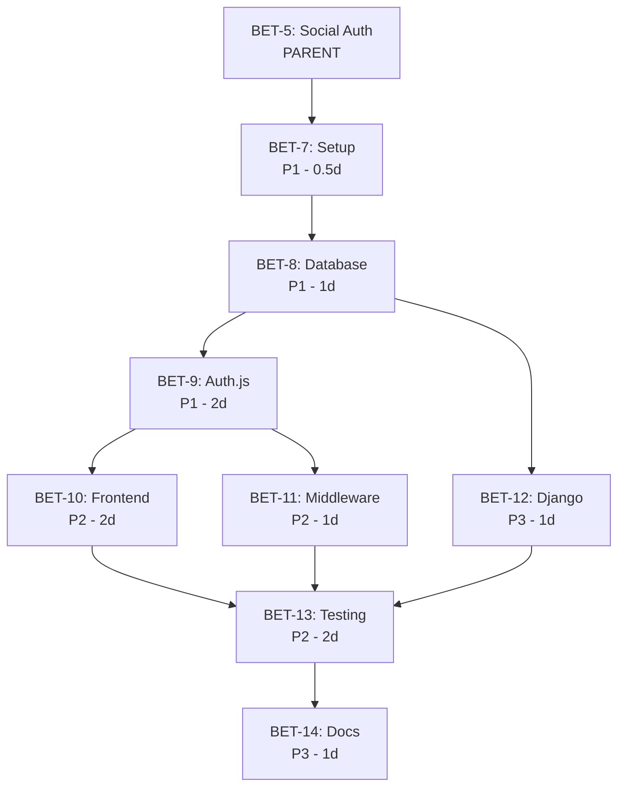

# BET-5: Social Authentication - Roadmap Ejecutable

**Issue Padre:** [BET-5: Social Authentication - Product Requirements Document](https://linear.app/betancourt-website/issue/BET-5/autenticacion-social-omnicanal-oauth)
**Fecha de Creación:** 2025-12-25
**Total de Issues Creados:** 8 fases
**Estimación Total:** ~2-3 semanas (depende del ritmo de desarrollo)

---

## Resumen Ejecutivo

Este roadmap convierte el plan de solución de BET-5 en un conjunto ejecutable de issues en Linear. La implementación está dividida en 8 fases lógicas que van desde la configuración inicial hasta el deploy en producción.

### Objetivos del Proyecto
- Implementar autenticación OAuth 2.0 con 4 proveedores (Google, Apple, Facebook, Microsoft)
- Reducir fricción en el proceso de onboarding (<30 segundos de registro)
- Mantener sesiones seguras con JWT stateless
- Integrar con infraestructura existente (Next.js + Django + PostgreSQL)

---

## Estructura del Roadmap

```
BET-5 (Padre)
├── Fase 1: Setup y Configuración [BET-7]
├── Fase 2: Infraestructura de BD [BET-8]
├── Fase 3: Auth.js y OAuth [BET-9]
├── Fase 4: Frontend Components [BET-10]
├── Fase 5: Middleware y Rutas [BET-11]
├── Fase 6: Backend Django [BET-12]
├── Fase 7: Testing y QA [BET-13]
└── Fase 8: Docs y Deploy [BET-14]
```

---

## Fases de Implementación

### 🔧 Fase 1: Setup y Configuración de Dependencias
**Issue:** [BET-7](https://linear.app/betancourt-website/issue/BET-7/fase-1-setup-y-configuracion-de-dependencias)
**Prioridad:** Alta (P1)
**Estimación:** 0.5 días
**Labels:** `backend`, `frontend`

**Objetivos:**
- Instalar Auth.js (NextAuth.js v5)
- Instalar Prisma como ORM
- Configurar variables de entorno base
- Generar AUTH_SECRET

**Acceptance Criteria:**
- [ ] Todas las dependencias instaladas sin conflictos
- [ ] Archivo `.env.local` creado con placeholders
- [ ] AUTH_SECRET generado correctamente

**Dependencias:** Ninguna (punto de inicio)

---

### 🗄️ Fase 2: Infraestructura de Base de Datos
**Issue:** [BET-8](https://linear.app/betancourt-website/issue/BET-8/fase-2-infraestructura-de-base-de-datos)
**Prioridad:** Alta (P1)
**Estimación:** 1 día
**Labels:** `backend`, `database`

**Objetivos:**
- Crear schema de Prisma (User, Account, Session, VerificationToken)
- Generar y aplicar migraciones
- Verificar creación de tablas en PostgreSQL
- Configurar índices para optimización

**Acceptance Criteria:**
- [ ] Schema define todas las tablas necesarias
- [ ] Migraciones aplicadas sin errores
- [ ] Tablas creadas con constraints correctos
- [ ] Índices configurados

**Dependencias:**
- ✅ **BET-7** (requiere Prisma instalado)

---

### 🔐 Fase 3: Configuración de Auth.js y Proveedores OAuth
**Issue:** [BET-9](https://linear.app/betancourt-website/issue/BET-9/fase-3-configuracion-de-authjs-y-proveedores-oauth)
**Prioridad:** Alta (P1)
**Estimación:** 2 días
**Labels:** `backend`, `auth`, `oauth`

**Objetivos:**
- Configurar Auth.js con JWT strategy
- Configurar 4 proveedores OAuth (Google, Apple, Facebook, Microsoft)
- Implementar callbacks (JWT, session, authorization)
- Crear route handlers en `/api/auth/[...nextauth]`

**Acceptance Criteria:**
- [ ] Los 4 proveedores OAuth funcionando
- [ ] Scopes mínimos configurados (openid, email, profile)
- [ ] Callbacks implementados correctamente
- [ ] Sesiones JWT creándose correctamente

**Dependencias:**
- ✅ **BET-7** (requiere Auth.js)
- ✅ **BET-8** (requiere schema de BD)

---

### 🎨 Fase 4: Componentes Frontend de Autenticación
**Issue:** [BET-10](https://linear.app/betancourt-website/issue/BET-10/fase-4-componentes-frontend-de-autenticacion)
**Prioridad:** Media (P2)
**Estimación:** 2 días
**Labels:** `frontend`, `ui`, `auth`

**Objetivos:**
- Crear AuthContext provider
- Crear AuthModal con 4 botones sociales
- Integrar con Navbar (login button / user profile)
- Implementar loading states y error handling
- Integrar con i18n existente (EN/ES)

**Acceptance Criteria:**
- [ ] AuthContext expone session, signIn, signOut
- [ ] AuthModal renderiza 4 botones estilizados
- [ ] Navbar muestra estado correcto según autenticación
- [ ] Loading states visibles durante OAuth
- [ ] Error messages traducidos
- [ ] Diseño responsive y accesible (WCAG 2.1 AA)

**Dependencias:**
- ✅ **BET-9** (requiere Auth.js configurado)

---

### 🛡️ Fase 5: Protección de Rutas y Middleware
**Issue:** [BET-11](https://linear.app/betancourt-website/issue/BET-11/fase-5-proteccion-de-rutas-y-middleware)
**Prioridad:** Media (P2)
**Estimación:** 1 día
**Labels:** `frontend`, `backend`, `auth`, `middleware`

**Objetivos:**
- Crear `middleware.ts` en raíz
- Implementar validación de sesión
- Configurar matcher patterns (`/dashboard/*`, `/admin/*`)
- Actualizar páginas protegidas con loading states

**Acceptance Criteria:**
- [ ] Middleware valida sesión en cada request
- [ ] Usuarios no autenticados redirigidos a `/`
- [ ] Rutas públicas no afectadas
- [ ] Performance <10ms para validación
- [ ] No hay flickering en UI

**Dependencias:**
- ✅ **BET-9** (requiere Auth.js configurado)
- ✅ **BET-10** (mejor UX con componentes frontend)

---

### 🐍 Fase 6: Integración Backend Django
**Issue:** [BET-12](https://linear.app/betancourt-website/issue/BET-12/fase-6-integracion-backend-django)
**Prioridad:** Baja (P3)
**Estimación:** 1 día
**Labels:** `backend`, `django`

**Objetivos:**
- Crear app Django `authentication`
- Definir modelos User, Account con `managed=False`
- Configurar relaciones entre modelos
- Registrar en Django Admin (opcional)

**Acceptance Criteria:**
- [ ] Modelos Django creados correctamente
- [ ] Django puede leer usuarios de BD
- [ ] No hay conflictos de ORM con Prisma
- [ ] Admin muestra usuarios (opcional)

**Dependencias:**
- ✅ **BET-8** (requiere schema de BD)
- ✅ **BET-9** (mejor si Auth.js ya está creando datos)

---

### 🧪 Fase 7: Testing y Validación de Calidad
**Issue:** [BET-13](https://linear.app/betancourt-website/issue/BET-13/fase-7-testing-y-validacion-de-calidad)
**Prioridad:** Media (P2)
**Estimación:** 2 días
**Labels:** `testing`, `qa`

**Objetivos:**
- Verificar flujo OAuth completo (4 proveedores)
- Validar session management
- Verificar route protection
- Auditoría de seguridad (cookies, CSRF, secrets)
- Testing de UX (responsive, a11y, i18n)

**Acceptance Criteria:**
- [ ] Todos los flujos OAuth funcionando
- [ ] Session management validado
- [ ] Route protection funciona correctamente
- [ ] Security checklist completo
- [ ] UX testing aprobado

**Dependencias:**
- ✅ **BET-10** (Frontend)
- ✅ **BET-11** (Middleware)
- ✅ **BET-12** (Backend Django)

---

### 📚 Fase 8: Documentación y Preparación para Deploy
**Issue:** [BET-14](https://linear.app/betancourt-website/issue/BET-14/fase-8-documentacion-y-preparacion-para-deploy)
**Prioridad:** Baja (P3)
**Estimación:** 1 día
**Labels:** `documentation`, `devops`

**Objetivos:**
- Crear `.env.example` completo
- Documentar setup de OAuth providers
- Actualizar README
- Comentar código crítico
- Crear guía de troubleshooting
- Verificar que no hay secretos en repo

**Acceptance Criteria:**
- [ ] `.env.example` actualizado
- [ ] Documentación de OAuth setup completa
- [ ] README actualizado
- [ ] Código comentado apropiadamente
- [ ] Guía de troubleshooting creada
- [ ] Git history limpio

**Dependencias:**
- ✅ **BET-13** (requiere testing completo)

---

## Gráfico de Dependencias



---

## Timeline Estimado

| Semana | Fases | Issues | Estimación |
|--------|-------|--------|------------|
| **Semana 1** | Setup + Infraestructura + Auth.js | BET-7, BET-8, BET-9 | 3.5 días |
| **Semana 2** | Frontend + Middleware + Django | BET-10, BET-11, BET-12 | 4 días |
| **Semana 3** | Testing + Documentación | BET-13, BET-14 | 3 días |
| **TOTAL** | 8 Fases | 8 Issues | **10.5 días** |

> **Nota:** Los tiempos son estimaciones y pueden variar según la experiencia del equipo y la complejidad de configuración de OAuth providers.

---

## Criterios de Éxito (del Plan de Solución)

### Funcionales
- ✅ Todos los 4 OAuth providers funcionando (Google, Apple, Facebook, Microsoft)
- ✅ Usuarios creados automáticamente en PostgreSQL en primer login
- ✅ Sesiones persistentes (JWT stateless)
- ✅ Rutas protegidas funcionando (`/dashboard`, `/admin`)
- ✅ Profile data visible en UI (nombre, email, avatar)
- ✅ Mensajes de error amigables
- ✅ Django puede leer datos de usuarios

### No Funcionales
- ✅ Session validation <10ms
- ✅ OAuth flow <3s end-to-end
- ✅ OWASP compliance
- ✅ WCAG 2.1 AA accessibility
- ✅ Horizontal scalability (stateless JWT)

### Documentación
- ✅ Variables de entorno documentadas
- ✅ OAuth setup completo para los 4 providers
- ✅ README actualizado
- ✅ Código comentado en secciones críticas

---

## Issues Creados en Linear

| # | Issue ID | Título | URL |
|---|----------|--------|-----|
| 0 | BET-5 | Social Authentication - PRD (Padre) | [Ver en Linear](https://linear.app/betancourt-website/issue/BET-5/autenticacion-social-omnicanal-oauth) |
| 1 | BET-7 | Fase 1: Setup y Configuración | [Ver en Linear](https://linear.app/betancourt-website/issue/BET-7/fase-1-setup-y-configuracion-de-dependencias) |
| 2 | BET-8 | Fase 2: Infraestructura de BD | [Ver en Linear](https://linear.app/betancourt-website/issue/BET-8/fase-2-infraestructura-de-base-de-datos) |
| 3 | BET-9 | Fase 3: Auth.js y OAuth | [Ver en Linear](https://linear.app/betancourt-website/issue/BET-9/fase-3-configuracion-de-authjs-y-proveedores-oauth) |
| 4 | BET-10 | Fase 4: Frontend Components | [Ver en Linear](https://linear.app/betancourt-website/issue/BET-10/fase-4-componentes-frontend-de-autenticacion) |
| 5 | BET-11 | Fase 5: Middleware y Rutas | [Ver en Linear](https://linear.app/betancourt-website/issue/BET-11/fase-5-proteccion-de-rutas-y-middleware) |
| 6 | BET-12 | Fase 6: Backend Django | [Ver en Linear](https://linear.app/betancourt-website/issue/BET-12/fase-6-integracion-backend-django) |
| 7 | BET-13 | Fase 7: Testing y QA | [Ver en Linear](https://linear.app/betancourt-website/issue/BET-13/fase-7-testing-y-validacion-de-calidad) |
| 8 | BET-14 | Fase 8: Docs y Deploy | [Ver en Linear](https://linear.app/betancourt-website/issue/BET-14/fase-8-documentacion-y-preparacion-para-deploy) |

---

## Próximos Pasos

1. **Revisar el Roadmap** con el equipo de desarrollo
2. **Asignar Issues** a los desarrolladores correspondientes
3. **Configurar OAuth Apps** en Google, Facebook, Apple, Microsoft (puede hacerse en paralelo)
4. **Comenzar con BET-7** (Setup y Configuración)
5. **Seguir el orden de dependencias** para evitar bloqueos

---

## Referencias

- **Plan de Solución Original:** `.issues/BET-5_shaping_solution.md`
- **PRD Completo:** [BET-5 en Linear](https://linear.app/betancourt-website/issue/BET-5/autenticacion-social-omnicanal-oauth)
- **Documentación Auth.js:** https://authjs.dev
- **Documentación Prisma:** https://www.prisma.io/docs

---

**Estado:** ✅ Roadmap Completo
**Última Actualización:** 2025-12-25
**Creado por:** Claude Code (Roadmap Command)
